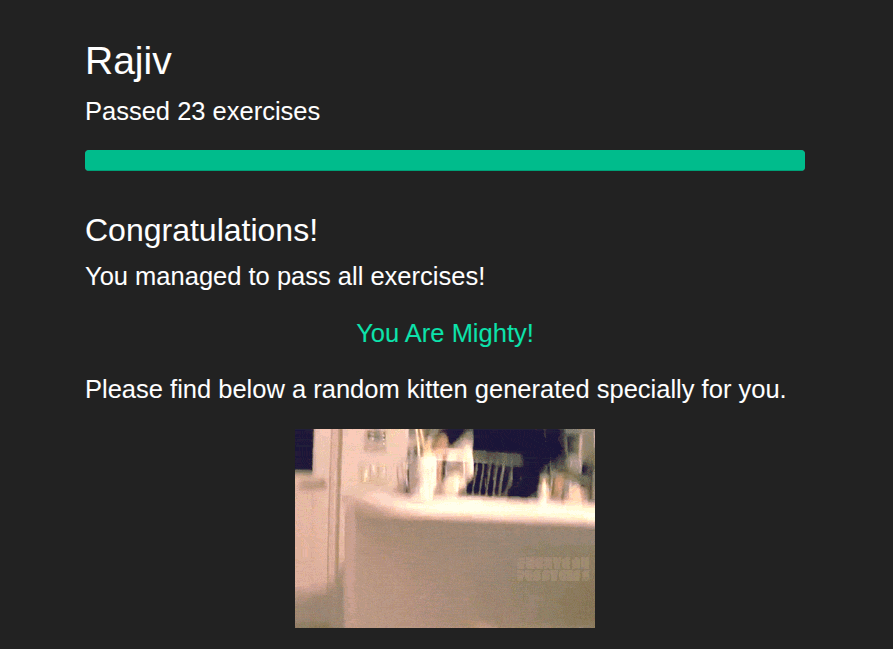

# Task - 01 : Git Exercises
- ```git add file.txt```: stages file.txt for commit. ```add .``` stages every changed file.
- ```git commit -m "hello"```: A sort of "checkpoint" for your files. -m defines the message(in this case "hello"). Add file name to commit only one file.
- ```git push```: Basically commit but to a remote network. Commit is for our machine, push is for the git repository on the internet.
- ```touch .gitignore```: touch command creates file. I used it to make the .gitignore file for "ignore-them"
- ```nano .gitignore```: opens in-terminal editor for file.
- ```git merge branch_name```:merges ```branch_name``` to current branch
- ```git status```: tells which branch we are on. And pending commits. Not really used with a specific level in mind just to know where i was as i was getting a few errors with too many commits/files.
- ```git stash```: used to create a temporary save point. As fracz said "You can think of stash as an intelligent Git clipboard".
- ```git stash pop```: takes your temporary save point and puts it right back
- ```git rebase branch_name```:pretty much a linear merge. normal merge makes it look like the 2 branches were worked on simultaneously. Rebase rewrites everything and makes it look linear from the common commit. Merge is still more accurate but rebase looks cleaner i guess.
- ```git rm file.txt```:removes file from repo.
- ```git mv old.txt new.txt```: renames old.txt to new.txt
- ```git commit --amend```:edits last commit
- ```git commit --amend --no-edit```: change only commited files but no edit message
- ```git commit --amend --no-edit --date="1987-08-03"```: overrides timestamp of commit too
- ```git rebase -i HEAD~3^```: Enables editing last 3 commits. basically a more powerful ```commit --amend```.
- ```git rebase --continue```: I guess thats for continuing the commit edit chain. Idk git told me to run it.
- ```git reflog```:will show all commit history
- ```q```: exits from git reflog 🥲. pretty stupid fix 😭.
- ```git reset --hard "e73b6b3"```: points to the commit with sha "e73b6b3"
- ```git reset HEAD~1```: resets to previous commit. I tried ```git reset HEAD@{}``` but then i found out that it refers to my current state not my previous commit.
- ```git rebase --interactive```: lets you do rebase interactively per commit. To squash n+1 commits to one, have 1st commit as pick and the rest n commits as squash. Rebase lets you reapply commits on other base tips.
- ```git add --chmod=+x script.sh```: stages permission change of "executable" (+x) for script.sh
- ```git add -p```: lets you stage interactively. entering "s" splits the hunk into smaller parts.
- ```git cherry-pick```: lets you rearrange commits linearly. I had to resolve a merge conflict in this exercise too.
- ```git rebase --onto your-master issue-555 rebase-complex```:  lets you rebase. Basically, in simple terms, lets you place ```rebase-complex``` on ```your-master``` while ignoring ```issue-555```.
- ```git log -S word```:search for commits that introduced word.
- ```git bisect start```:git bisect does a binary search so that we can find problematic commits
- ```git bisect bad```:tells the bisect to mark it as a bad commit. no argument means current head is considered as bad.
- ```git bisect good 1.0```:tells the bisect the commit we know is good. here the commit labelled 1.0 is good.
- ```git bisect run sh -c"command"```: helps to automate the checking. otherwise we would have to manually go across each commit bisect gives us, run the openssl command and mark the commit as good or bad each time. This particular exercise took 7 iterations. 

## Certificate

